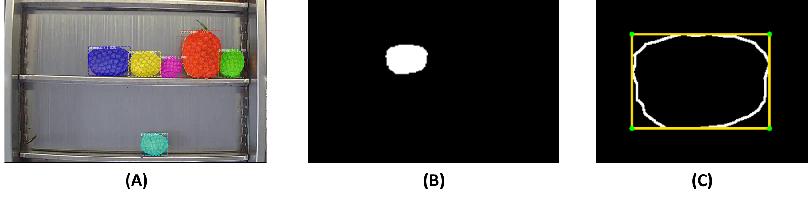

# Object Detection and Size Determination of Pineapple Fruit at a Juicing Factory

The aim of this research was to develop a method for determining pineapple fruit size from images. This was achieved by first detecting pineapples in each image using the [matterport implementation](https://github.com/matterport/Mask_RCNN) of Mask Region-based Convolutional Neural Network ([Mask R-CNN](https://arxiv.org/abs/1703.06870)) and then extracting the pixel diameter and length measurements, and the projected areas, from the detected mask outputs using OpenCV.

In the image below, (A) shows the masks detected by a Mask R-CNN trained to locate pineapples on a conveyor belt, (B) shows one of the binary mask outputs of the Mask R-CNN and (C) shows the rotated minimum area bounding box enclosing the binary mask.

The repository includes:
* Link to datasets for:
    - Training, validation and testing of Mask R-CNN
    - Evaluation of size determination approach
* Colab notebooks for training and evaluation of Mask R-CNN models for pineapple detection
* Jupyter notebooks for size extraction from detected masks using OpenCV

## Installation

1. Clone the [Matterport Mask R-CNN repository](https://github.com/matterport/Mask_RCNN) and follow the installation instructions.
2. Download pineapple datasets `datasets.zip` [here](https://drive.google.com/drive/folders/1OQQOM0r_9_lTYDCh-D4nksKNZFarVFyL?usp=sharing). Expand it such that it's in the path `Mask_RCNN/datasets/`.
3. Download `mask_rcnn_pineapple.h5` from [here](https://drive.google.com/drive/folders/1OQQOM0r_9_lTYDCh-D4nksKNZFarVFyL?usp=sharing) and save it to the root directory of the repo (i.e. in the `Mask_RCNN` directory).
4. Create a conda environment using `pineappleEnvironmment.yml`. Instructions on how to do so can be found [here](https://docs.conda.io/projects/conda/en/latest/user-guide/tasks/manage-environments.html#creating-an-environment-from-an-environment-yml-file)

## Datasets

More information is given in the `README` in the [`data`](https://github.com/Jess-cah/measure-pineapple/tree/main/data) folder. 

In summary:
* `datasets/pineapple160` is used for training of pineapple detector
* `datasets/fruitsizeA`, `datasets/fruitsizeB` and `datasets/fruitsizeAB` are used for evaluation of the size determination approach, as they contain images that had not previously been seen by the model (i.e. had not been used in the training or validation of the Mask R-CNN). The pineapples in these images had been manually measured using callipers prior to image acquisition. 
* `measured_sizes.xlsx` contains the manual measurements can be found in the [`data`](https://github.com/Jess-cah/measure-pineapple/tree/main/data) folder.

## Training a Mask R-CNN pineapple detector
* The `measure-pineapple/detector` folder contains files related to training and evaluation of Mask R-CNN pineapple detectors. 
* Colab notebook `maskpine_160images_coco_resnet50_aug4_ALL_01.ipynb` shows training of Mask R-CNN using COCO starting weights and ResNet50 backbone, and employing data augmentation techniques. Colab was used in order to make use of GPU facilities.
* Use `init_with = "coco"` to initialise with MS COCO starting weights. Can also use `"imagenet"` to initialise with ImageNet starting weights.
* In `pineapple.py`, `BACKBONE = "resnet50"` means that a ResNet50 CNN backbone will be used. Alternatively, this can be set to `"resnet101"`.
* The dataset `datasets/pineapple160` contains 160 images but these are split as 70/20/10 for training/validation/test.
* Detectors are evaluated using AP@0.5 and AP@[0.50:0.05:0.95], as shown in ``.

## Detect and measure pineapples in images
* The `measure-pineapple/measurement` folder contains files related to determining pineapple fruit size from images. 
* Detection and measurement of pineapples from images was done using Juypter notebooks on a local machine, in a conda environment that can be replicated using `pineappleEnvironmment.yml`.
* The `predict_measure_04_batch_noAnnot.ipynb` Jupyter notebook is used for extraction of pineapple diameter and length dimensions from the detected masks.
* The `predict_measure_projectedArea.ipynb` Jupter notebook is used to extract the projected area of detected masks.
* Visualisation and comparison of the detected and hand-measured fruit dimensions are shown in `resnet50_fruitsize_distributions_Model4_FlipLR.ipynb`.
